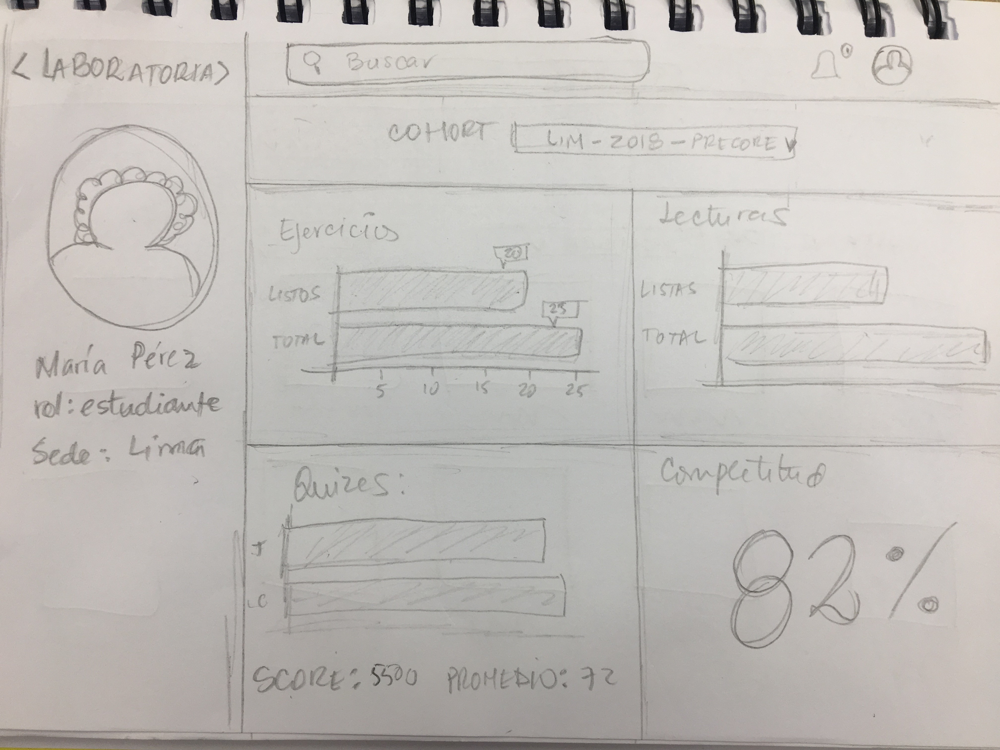
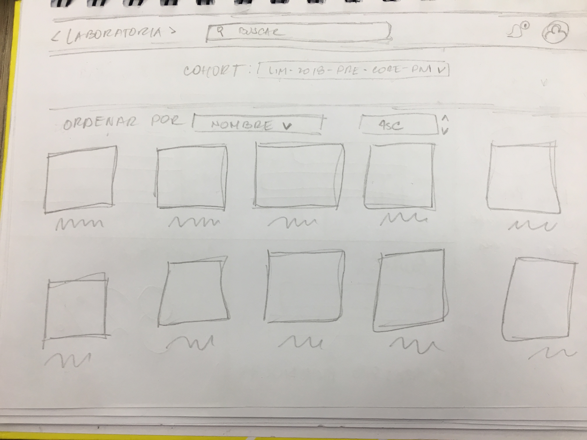
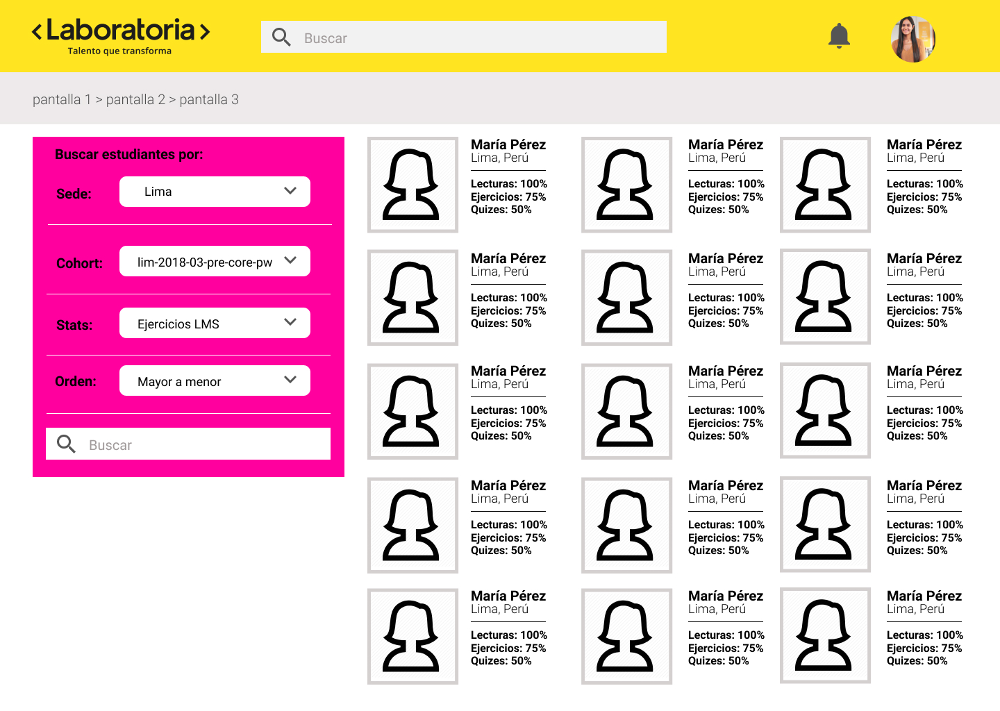
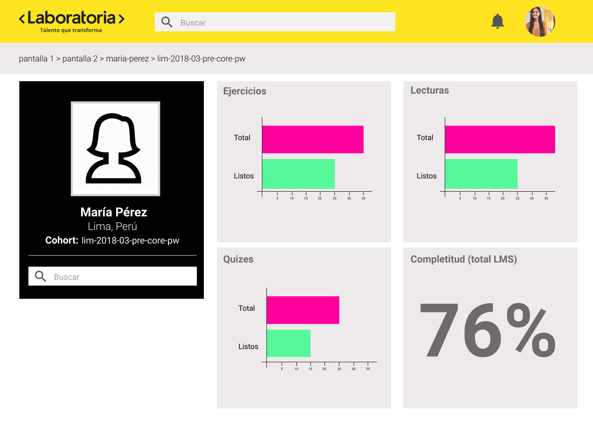
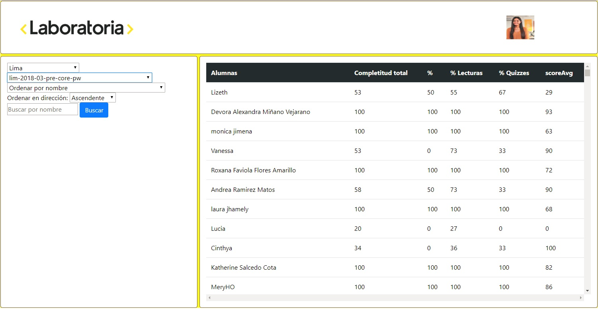
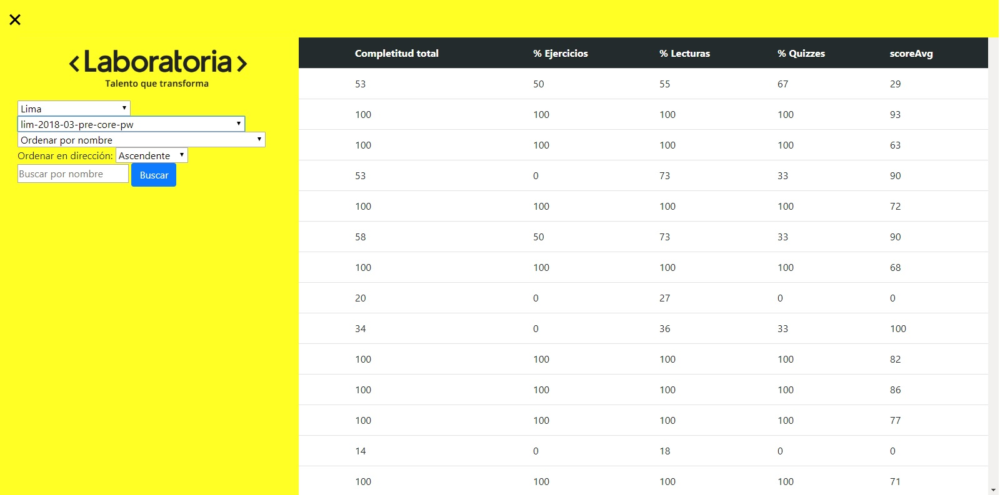

# Data Dashboard - Laboratoria

## Principales usuarios del producto

Los principales usuarios son los Training Managers de Laboratoria, quienes frecuentemente necesitan ver la data de los estudiantes de una forma más visual, ordenada y rápida.

## Objetivos de los usuarios

A través de encuestas descubrimos que los datos más relevantes que desean ver en la interfaz son:

1. Los porcentajes de completitud de quizes, examenes y lecturas en el LMS
2. Puntajes en quizes tanto individuales como por cohorts
3. El total de alumnos de cada cohorts y por sedes
4. Gráficos que contengan estadisticas generales del LMS
5. Ordenar de manera ascendente o descendente a las usuarias según su puntaje en quizes.

Normalmente los TM's revisan la infomación de las estudiantes antes del bootcamp (con los datos de pre-admisión), durante y después del bootcamp. El dashboard creado estará accesible siempre
para brindarles acceso rápido, ordenado, visual e interactivo de las estadisticas del LMS.

## Proceso de diseño

Se plantearon originalmente en 2 pantallas, una con la información general de las estudiantes, y otra con la información de cada una (perfil). 

## Protitipado

Una vez obtenido nuevamente el feedback de las usuarias, se realizaron modificaciones importantes, como:

1. Se agregó una columna lateral, donde podrá seleccionar los datos según su requerimiento.
2. Barra de búsqueda en la columna lateral.
3. En la previsualización de las usuarias se muestra también las estadisticas generales, que podrán ahora ordenarse en forma ascendente y descendente.
4. Finalmente se realizan los prototipos de alta fidelidad, obteniendo los resultados de las siguientes imagenes:

## Maquetado

# Primera versión:

# Segunda versión:

Una vez realizados nuevos test, se concluye que es necesario poder ocultar la barra lateral para facilitar la visualización en distintos tamaños de pantallas. La usuaria manifiesta acceder 99 de cada 100 veces a través de computadoras / laptops, por lo que no se hace énfasis en mobile.

## Tecnologías utilizadas

1. HTML
2. CSS
3. Vanilla JavaScript
4. Boostrap (CSS)
5. Figma (Prototipado)
